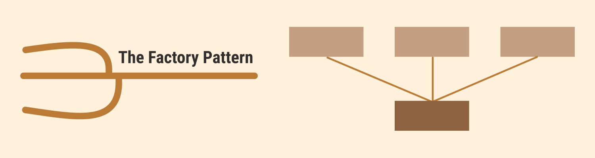

<div align="center">

# Factory Pattern Examples in TypeScript

<p align="center">
   <a href="https://github.com/Delvoid/the-factory-pattern/issues">Report Bug</a>
   ·
   <a href="https://github.com/Delvoid/the-factory-patternissues">Request Feature</a>
  </p>

</div>




This repository provides a collection of practical examples illustrating the implementation and usage of the Factory Pattern in TypeScript. The Factory Pattern is a versatile design pattern that simplifies object creation, by providing a method that acts as a “factory” for creating objects. It abstracts the instantiation process, allowing the type of object created to be determined at runtime.

## Key Benefits of the Factory Pattern

- **Flexible Object Creation:** Facilitates the creation of objects, allowing for instantiation logic to be defined in subclasses or configuration.
- **Decoupling:** Separates object creation from its usage in client code, adhering to the Single Responsibility Principle.
- **Extensibility:** Enables the easy addition of new classes and creation logic without altering existing code.
- **Manageable Complexity:** Organizes and simplifies client code, especially when multiple constructors or configurations are involved.

## Examples Overview

### [1. Logger System](src/logger/README.md)

- **Concept**: Develop different logger types using a Logger Factory.
- **Usefulness**: Switch between different logging mechanisms without changing client code.


### [2. Pizza Ordering System](src/pizza/README.md)

- **Concept**: Create different types of pizzas using a Pizza Factory.
- **Usefulness**: Easily introduce new pizza types without modifying existing code.


### [3. Theme Manager for UI](src/themeManager/README.md)

- **Concept**: Create different themes using a Theme Factory.
- **Usefulness**: Allows dynamic switching and easy addition of new themes.

### [4. Transport Vehicle Rental System](src/vehicleRental/README.md)

- **Concept**: Create vehicles like Cars, Bikes, or Scooters using a Vehicle Factory.
- **Usefulness**: Easily manage and extend various vehicle types in the rental system.

### More Examples to Explore

- **[5. Online Payment System](src/onlinePayment/README.md)**
- **[6. Graph Plotting System](src/graphPlotting/README.md)**
- **[7. Employee Management System](src/employeeManagement/README.md)**
- **[8. Game Character Generator](src/characterGenerator/README.md)**
- **[9. API Request Handler](src/apiRequestHandler/README.md)**
- **[10. Notification System](src/notificationSystem/README.md)**


## Usage

Each example in this repository is structured as a module within its own dedicated folder. However, all examples share a common TypeScript configuration and dependencies, which are defined at the root level of the project.

Here’s how you can run the examples:

1. **Clone the Repository:**
   ```
   git clone https://github.com/Delvoid/the-factory-pattern
   ```
2. **Install Dependencies:**
   Navigate to the root of the cloned repository and run:
   ```
   npm install
   ```
3. **Run an Example:**
   Use `ts-node` to run a specific example. Navigate to the respective example folder within the `src` directory, and run the `client.ts` file:
   ```
   npx ts-node src/logger/client.ts
   ```


## Contributing

Feel free to submit issues or pull requests if you have suggestions, corrections, or improvements to any of the examples. Contributions to add new examples illustrating the Factory Pattern are also welcome!


